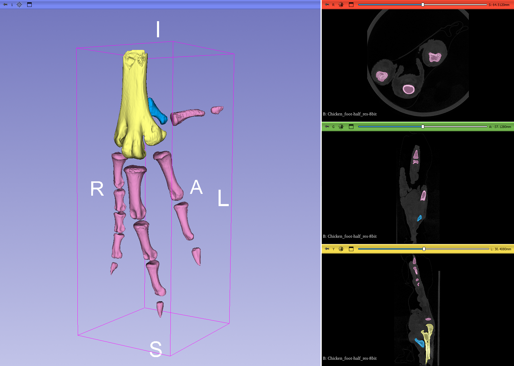

## MorphoDepot Repository
Repository for segmentation of a specimen scan.  See [this JSON file](MorphoDepotAccession.json) for specimen details.
* Species: Gallus gallus
* Modality: Micro CT (or synchrotron)
* Contrast: No
* Dimensions: (588, 651, 768)
* Spacing (mm): (0.084, 0.084, 0.168)

## Screenshots

_Chicken foot specimen scan with segmentation of skeletal system._

Preparation and Imaging History:

Domestic chicken foot, fixed, was CT scanned at 42 microns (isometric voxels) and 16 bit image depth on a SkyScan 1273. The subsequent scan was downsampled to 8 bit and 84 micron resolution, skipping every other slice, for Github distribution.

The sample was procured fresh from a local grocery vendor, fixed in buffered formalin and stored in 70% ethanol.

Micro-CT scanning was performed by Karly Cohen and took place in the laboratory of Adam Summers at Friday Harbor Laboratories, WA. Parameters included 50 kV, 200 microAmps, and 157 ms exposure. No filter was used.

